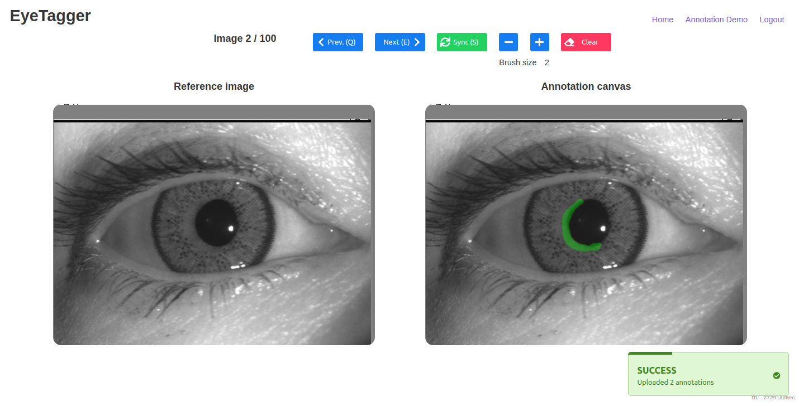

# EyeTagger | Iris Annotation Tool




## Summary

+ Dockerized application for simple deployment
+ PostgreSQL DB ⇿ Django + Gunicorn + Nginx web server ≤ REST API → Vue-based SPA + Vuex
+ Django Whitenoise to serve static files, CDN Ready
+ Annotations stored in relational database
+ Access control / user management
+ Vuex handles state management and persistence to never lose annotations on the front-end

## 1. Getting Started

### 1.1. Dependencies

Before getting started you should have the following installed and running:

+ Docker >= v27 (with `docker compose` subcommand)

### 1.2. Link data

Create a location for the Postgres database

```bash
mkdir -p data/postgres cache/uv/venv
```

Data upload via web interface if not possible yet, so the data needs to be mounted inside the container.

If you have the images in the same machine, just put them in the expected location `data/dataset/` by creating a symbolic link (below):

> `ln -s    $MY_DATASET_LOCATION    $(pwd)/data/dataset`

Or just create a copy:

> `rsync -aP $MY_DATASET_LOCATION   $(pwd)/data/dataset`

Or, create a new location for a new dataset:

```bash
mkdir -p data/dataset
```

If your dataset is remote (cloud or another computer), you might want to start using `dvc`. Check the [Integrating DVC](#5-integrating-dvc-optional) session below.

### 1.3 Create environment

```sh
# copy all example dotenv files
cp "env/django_app.env.example" "env/django_app.env"
cp "env/django_db.env.example" "env/django_db.env"

# edit all env/*.env files setting the following:
#    DJANGO_STATIC_HOST
#    SECRET_KEY
#    DB_PASS
#    POSTGRES_PASSWORD (same as DB_PASS)
EDITOR=${EDITOR:-nano}
find env -name "*.env" -exec "$EDITOR" {} \;
```

### 1.4. Run services

#### Install Packages

```sh
# create the public network
docker network create net-nginx-proxy

# build docker images and run containers
docker compose up

# from another terminal, run the database migrations
docker compose exec web uv run /app/manage.py migrate

# create django superuser
docker compose exec web uv run /app/manage.py createsuperuser

# access localhost:80 in your browser
```

---

## 2. Management

### 2.1 CLI access to services

#### Django + Vue container

> `docker compose exec web /bin/bash`

#### Nginx container

> `docker compose exec nginx /bin/sh`

#### PostgreSQL container

> `docker compose exec db psql --username eyetagger_admin --dbname eyetagger`

More PostgreSQL commands:

```sh
\h  # help
\q  # quit
\l  # list databases
\d  # list tables / relations
\d api_annotation   # describe a table / relation

# run a query - don't forget the semicolon:
SELECT id, annotator_id, image_id FROM api_annotation;
```

### 2.2 Dashboards

| Feature                     | Default location                         | Comment                                                                          |
| --------------------------- | ---------------------------------------- | -------------------------------------------------------------------------------- |
| Django REST Framework       | [/api](http://localhost/api)             | Only available in development mode (_i.e._ `DEBUG=True` in `env/django_app.env`) |
| Django Administration Panel | [/api/admin](http://localhost/api/admin) | Credentials created with `uv run ./manage.py createsuperuser`                    |

### 2.3 Template Structure

| Location from project root | Contents                                |
| -------------------------- | --------------------------------------- |
| `backend/`                 | Django Project & Backend Config         |
| `backend/api/`             | Django App for REST `api`               |
| `data/`                    | Git-ignored: DB + backups               |
| `deploy/`                  | Scripts and configuration files         |
| `dist/`                    | Git-ignored: back+front generated files |
| `env/`                     | Environment Files                       |
| `public/`                  | Static Assets                           |
| `src/`                     | Vue App                                 |

### 2.4 Database

#### A. Backing up a DB (dump)

To run it once:

```sh
# docker compose up db          # if db container is not running
docker compose exec db pg_dump -U eyetagger_admin eyetagger | \
    gzip > eyetagger_bkp_$(date +"%Y_%m_%d_%I_%M_%p").sql.gz
```

Check [backups.sh](./backups.sh) for a simple automated version.

> Tip: you can add the existing `backups.sh` to your `crontab -e` for periodic backups:

```txt
To run it every 6 hours:
0 */6 * * * /eyetagger/backups.sh >> /eyetagger/data/logs/backups.log 2>&1

Or every business day (Mon-Fri) at 6pm:
0 18 * * 1-5 /eyetagger/backups.sh >> /eyetagger/data/logs/backups.log 2>&1
```

#### B. Restoring a Backup

```sh
# replace $YOUR_DUMP_GZ by your .gz location:

# let's copy the backup before moving/modifying it
cp $YOUR_DUMP_GZ /tmp/dump.sql.gz

# extract the dump
gunzip -k /tmp/dump.sql.gz

# copy to the running DB container
# docker compose up db          # if db container is not running
docker cp /tmp/dump.sql eyetagger_db_1:/dump.sql

# create a new empty database
docker compose exec db createdb -U eyetagger_admin -T template0 eyetagger_new

# populate the empty database with the dump
docker compose exec db psql -U eyetagger_admin -d eyetagger_new -f /dump.sql

# swap database names
docker compose exec db psql --username eyetagger_admin --dbname postgres
\l
ALTER DATABASE eyetagger RENAME TO eyetagger_old;
ALTER DATABASE eyetagger_new RENAME TO eyetagger;
\l
\q

# get the other services up and try it out!
docker compose down && docker compose up

# if successful, clean the temporary backup copies
rm      /tmp/dump.sql.gz     /tmp/dump.sql
```

## 3. Development Deploy (Default)

1. There are 2 entries `command` under `docker compose.yaml` > Service `web`. Select the "development" one by commenting out the alternative.

2. Run `docker compose up` (run `down` first if already up) and open `localhost:9000`. Hot reload should be enabled i.e. live changes to the front-end code will update the browser.

## 4. Production Deploy (Optional)

1. Adapt the environment files for the backend in `env/`.
2. Adapt the environment file for the frontend in `vue.config.js`.
3. Follow the [Django deployment checklist](https://docs.djangoproject.com/en/2.1/howto/deployment/checklist/) for further configuration.
4. Deploy the dockerized application in a remote server by running it in daemon form: `docker compose up -d && docker compose logs -f`.

## 5. Integrating DVC (Optional)

1. Install `dvc` on host:

    > `uv tool install dvc`

    or:

    > `pipx install dvc`

    then check with:

    > `dvc --version`

2. Setup access (using GCP below)

    ```sh
    # get provider-specific api
    uv tool install 'dvc[gs]' # or pipx install 'dvc[gs]'

    # create google bucket credentials
    mkdir -p $HOME/.gcp/
    GOOGLE_APPLICATION_CREDENTIALS=$HOME/.gcp/iris-admin.json

    # paste the contents of the GCP JSON in this file
    # see https://cloud.google.com/docs/authentication/getting-started"
    nano $GOOGLE_APPLICATION_CREDENTIALS
    chmod 400 $GOOGLE_APPLICATION_CREDENTIALS

    export GOOGLE_APPLICATION_CREDENTIALS
    echo -e ' >> Add this to your ~/.bashrc:\n\n\
        export GOOGLE_APPLICATION_CREDENTIALS='$GOOGLE_APPLICATION_CREDENTIALS'\n\n
    ```

3. Then get your data from the remote.

    > `dvc pull`

    Or add new data to the bucket

    > `dvc add data/dataset && dvc push`

## 6. Bringing your own dataset

Eyetagger handles two types of data: the images - referred to as the **dataset**, and the metadata - stored in a relational **database / db** using PostgreSQL.

Metadata is necessary to keep track of the annotations, who did them, when, and any other data attribute that might be useful for the annotation workload. The dataset is usually a set of images to be displayed during the annotation process.

In order to serve a custom dataset, you will need to first A. run the app creating a database (steps 1.1-1.4 above) and then B. create the metadata entries for your dataset in PostgreSQL.

Below we describe how to do this part B by using a database migration:

1. **Create a migration.**

    The metadata entries are created by running one or more database migrations. Let's create an empty one with:

    ```bash
    # this assumes your containers are up, make sure to run docker compose up first

    # below and onwards, "api" is the internal name of the Django app that we are working with
    docker compose exec web uv run /app/manage.py makemigrations api --name dataset_import --empty
    ```

    After this command will have a new Python file in the migrations' directory (e.g. `backend/api/migrations/####_dataset_import.py`).

2. **Call a new and customized migration script to ingest your dataset's metadata into the relational DB.**

    Change that created file to import your custom script as follows:

    ```python
    from backend.api.manual_migration import import_dataset

    # down in the Migration class, paste the following:
    class Migration(migrations.Migration):

        # ...

        initial = True

        # import_dataset is the function that will be called when you run the migration
        # reverse_code is the function that will be called when you rollback the migration, using a "no-op" function below
        operations = [
            migrations.RunPython(import_dataset, reverse_code=migrations.RunPython.noop)
        ]

        # ...

    ```

3. **Customize this migration script and ORM models to match your dataset.**

    + An example of a migration script can be found in `backend/api/manual_migration.py` - you can use this as a template for your own script.
    + All SQL code and database transactions are handled by Django's ORM, so you don't need to know SQL to populate the database.
    + The existing migration script loads a CSV file that contains metadata for each image. Because each dataset is unique, yours might have different attributes.
    + The `import_dataset` function in that script loads this CSV, creates all ORM objects (e.g. the `img` variable), and saves them to the database `img.save()`. The other functions help with this process.
    + Change the Image model:
        1. Modify `backend/api/models.py` to fit your needs.
        2. Run `/app/manage.py makemigrations` - this compares model.py to the database, if their schemas differ it'll generate code that describes a new migration.
        3. Run `/app/manage.py migrate` to "run" the necessary migrations, effectively updating the database. Django keeps track of the migrations that were run.
    + ⚠️ The attributes of your `Image` model should be close to the columns in your CSV file. If you try to store an ORM object that deviates from the table schema, the database transaction will fail.

4. **Run the migrations.**

    Only the necessary (new) migrations will be run with the following command:

    ```bash
    docker compose exec web uv run ./manage.py migrate
    ```

    > 💡 After you create (and save) some entries like `Image` objects, you will be able to see them in the Django admin panel (see [dashboards](#22-dashboards) above).

5. **Troubleshooting:** when a migration goes wrong.

    Errors might happen if the migration script is not correct. If so, you can **reverse** it with:

    ```bash
    # change 0001 below
    docker compose exec web uv run ./manage.py migrate api 0001
    ```

    Where `0001` is the number of the **previous** migration (i.e. the number `####` in `backend/api/migrations/####_migration_name.py`).

    Another way is to reset them all: [see scenario 2 in this guide](https://simpleisbetterthancomplex.com/tutorial/2016/07/26/how-to-reset-migrations.html), our "app name" is `api`.

    > **A note about migrations that change schemas:** if a migration modifies the database schema, make sure your rollback function also undoes those changes. For example, if migration `N` adds a new column to the `Image` model, and you roll back to `N-1`, this roll back function should also remove that column from the `Image` model. Otherwise, when you run `N` again, Django will try to create a column that already exists, which will fail. Because of this rollback complication, I chose to separate migrations that change the database schema (e.g. creating tables, modifying attributes) from migrations that populate the database with data (e.g. the one in `manual_migration.py`).

    Above are the best ways to fix migration issues and avoid corruption or data loss. But if losing data is not an issue, you can also delete the database and start over, for example:

    ```bash
    # ⚠️ this will cause data loss ⚠️
    docker compose exec db dropdb -U eyetagger_admin eyetagger
    docker compose exec db createdb -U eyetagger_admin eyetagger
    docker compose exec web uv run /app/manage.py migrate
    ```
